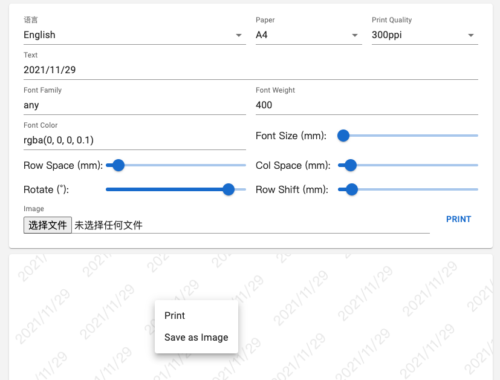

# Water Marker Array

### [Playground](https://allape.github.io/WaterMarkerArray/index.html)

### [中文](README.md) | [English](README.en.md)

### Known Issues
- Because default print settings will make a small border around the image. To eliminate the border will calculate as two pages sometimes.

#### Goal
- √ Basic functions
- √ i18n

#### Screenshots

#### Instructions
- If you want to export the desired-print-quality image, click 'Print' to export as PDF.
