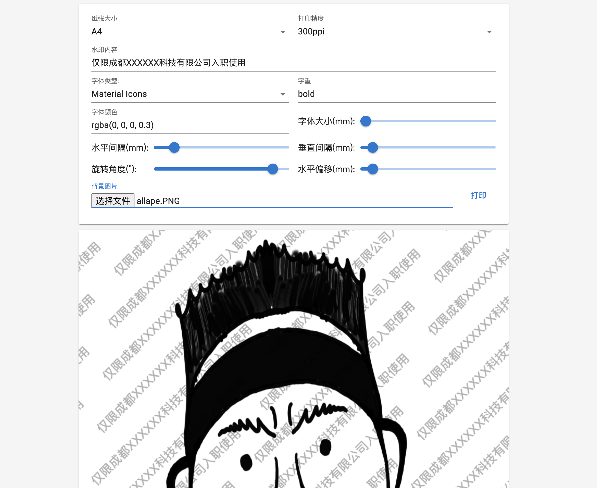

# Water Marker Array

## [Playground](https://allape.github.io/WaterMarkerArray/index.html)

### 进度 | Goal
- √ 基础功能 | Basic functions
- × i18n

### 截图 | Screenshots

### 使用方式 | Instructions
- 如果需要导出准确精度的图片, 点击打印 -> 选择导出为PDF即可.
- If you want to export the desired-print-quality image, click 'Print' to export as PDF.
