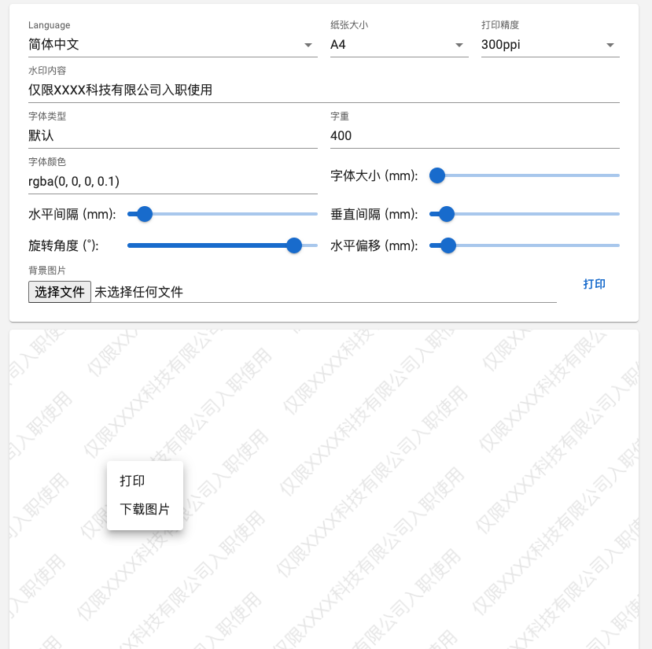

# Water Marker Array

## [Playground](https://allape.github.io/WaterMarkerArray/index.html)

## [中文描述](README.md) | [English](README.en.md)

### 进度
- √ 基础功能 | Basic functions
- √ i18n

### 截图

### 使用方式
- 如果需要导出准确精度的图片, 点击打印 -> 选择导出为PDF即可.
